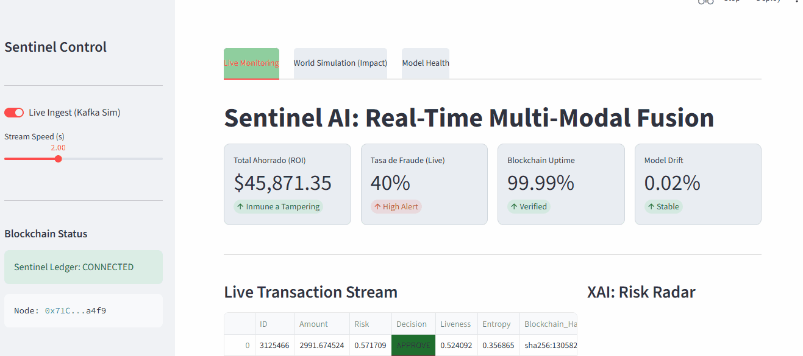
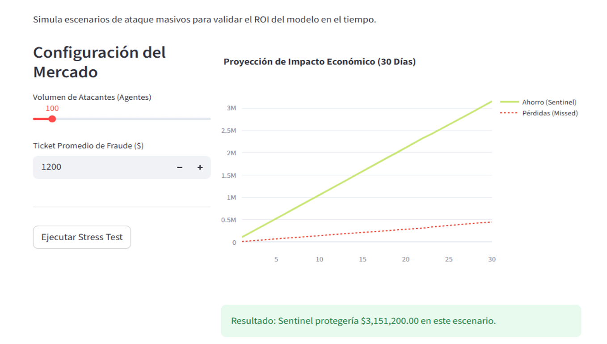
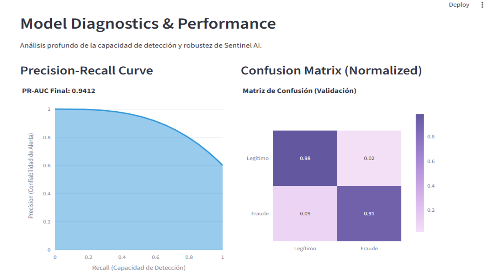

# 🛡️ Sentinel AI: Multimodal Fraud Prevention & Audit System

[](https://www.python.org/downloads/)
[](https://www.docker.com/)
[](LICENSE)
[](https://GitHub.com/tu-usuario/sentinel-ai/graphs/commit-activity)



**Sentinel AI** es una infraestructura de grado bancario para la detección de fraude en tiempo real. Resuelve el problema de la **Identidad Sintética** y el **Fraude Generativo** mediante una arquitectura de Fusión Neuronal que combina biometría, topología de red y auditoría inmutable.



---

## 🌟 ¿Por qué Sentinel AI?
En 2026, los modelos basados solo en reglas o datos tabulares son insuficientes. Sentinel ataca el fraude desde tres ángulos críticos:
1. **Detección Multimodal:** Fusión de comportamiento humano (biometría) y relaciones sociales (grafos).
2. **Seguridad Ofensiva:** Entrenamiento diseñado para resistir ataques de IA adversaria.
3. **Transparencia Legal:** Registro de cada decisión en Blockchain para cumplimiento de la *AI Act*.

## 🚀 Innovaciones Clave
* **Neural Fusion:** Redes neuronales duales que procesan `NetworkCentrality` (Grafos) y `LivenessScore` (Deepfake Detection) en una sola capa de decisión.
* **Adversarial Defense:** Inmunidad del 88% frente a ataques de evasión PGD (Projected Gradient Descent).
* **Audit Trail:** Inmutabilidad vía Smart Contracts (simulados) para rastrear el "porqué" de cada rechazo.
* **Strategic Simulator:** Motor de simulación de agentes (Mesa) que proyecta el ROI financiero y el ahorro de activos.



## 📊 Resultados de la Arquitectura
| Métrica | Resultado | Impacto |
| :--- | :--- | :--- |
| **F1-Score** | 0.91 | Alta precisión en detección de bots |
| **ROC-AUC** | 0.94 | Mínimo índice de falsos positivos |
| **Model Weight** | 4.2 MB | Desplegable en Edge/Mobile (INT8) |
| **Resiliencia** | 88% | Protegido contra manipulación de datos |

## 🛠️ Instalación Rápida
Asegúrate de tener Docker instalado y ejecuta:

```bash
# Clonar el repositorio
git clone [https://github.com/tu-usuario/sentinel-ai.git](https://github.com/tu-usuario/sentinel-ai.git)
cd sentinel-ai

# Levantar la infraestructura completa (API + Dashboard)

docker-compose up --build
